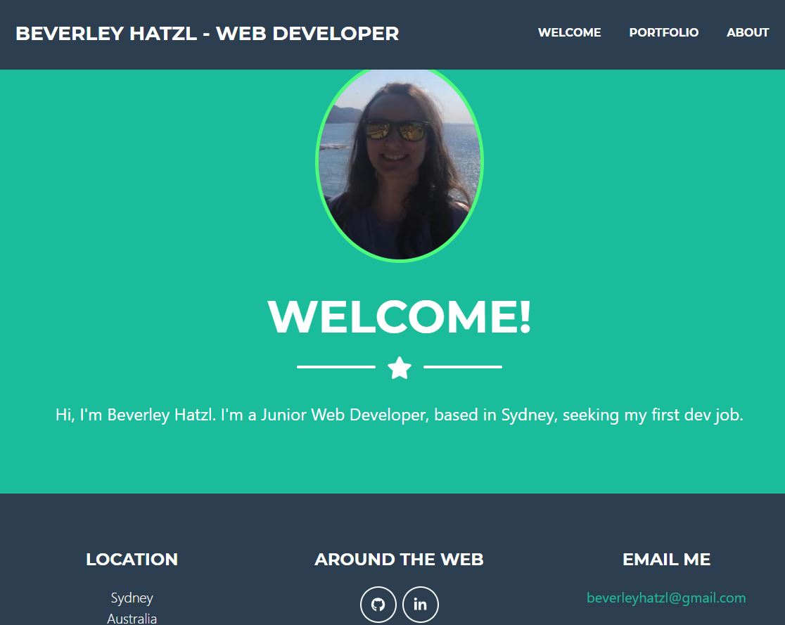
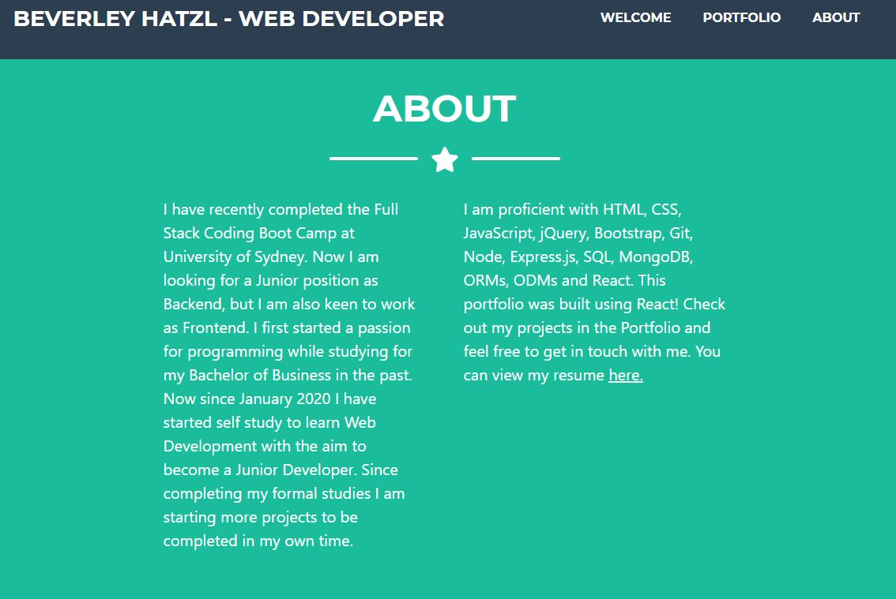
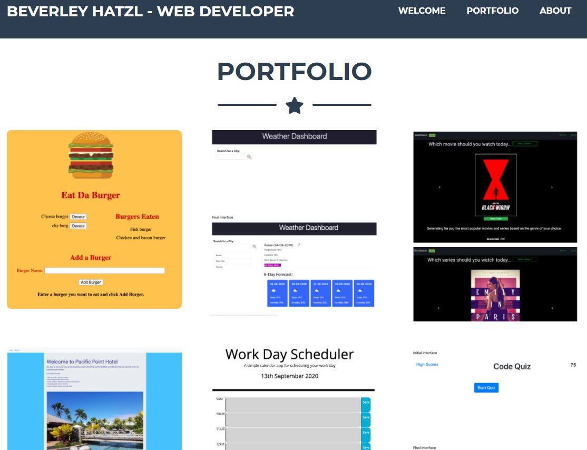

# React Portfolio

This is my portfolio created using React.
The link to the deployed site is here: https://bevhatzl.github.io/react-portfolio/#/
I used react-router-hash-link to allow scroll to top of page when clicking links.

# Table of Contents
* [Instructions](#instructions)
* [Built With](#built-with)
* [Screenshots](#screenshots)
* [Future Development](#future-development)
* [Author](#author)

## Instructions

Initial display will be a welcome screen with my photo. The navbar is at the top right and the footer displays my contact details.

The About page tells a summary about myself and my technical skills.

The Portfolio page shows 6 projects I have completed. Hover over each of them to read a description and find the links to GitHub and the deployed app.

## Built With

* [VScode] (https://code.visualstudio.com/) 
* [Create React App] (https://github.com/facebook/create-react-app)

## Screenshots

## Future Development

Future versions will have my updated projects.

## Author
Beverley Hatzl 2021
